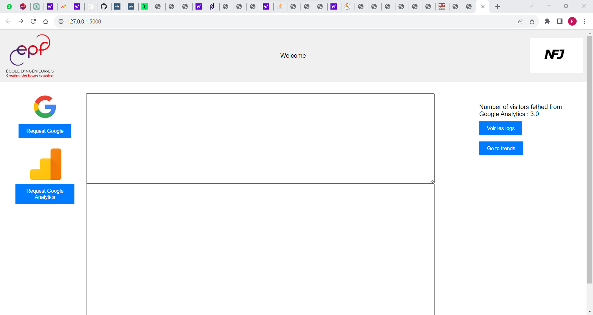
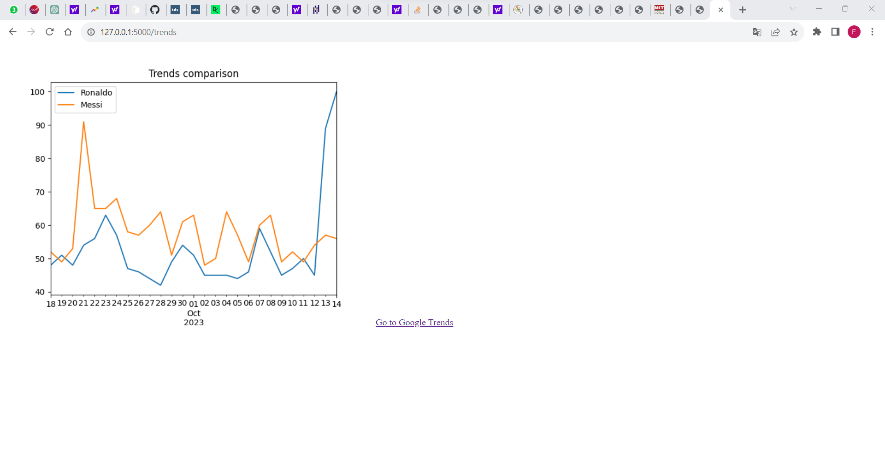
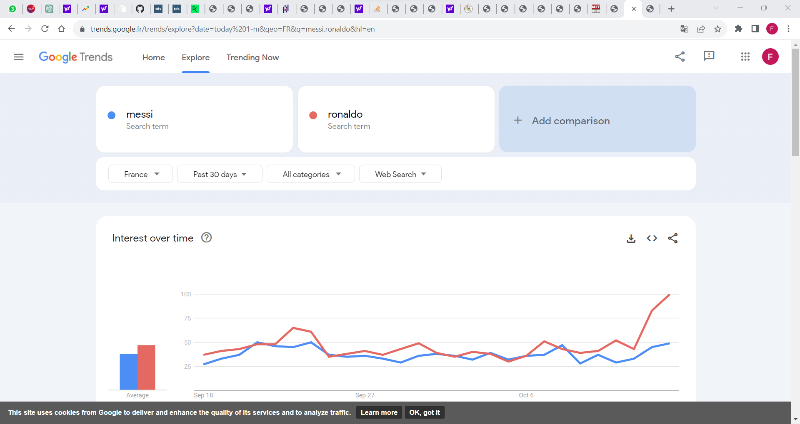

# My First Flask App

This an app developped using the framework Flask and accessible through the link : [https://tp1f-1-x1046768.deta.app/](https://tp1f-1-x1046768.deta.app/)

## Description
Our App has four functions:
* See logs
* Make a request to Google
* Make a request to Google Analytics
* Get the number of users from Google Analytics
* Make a trend comparison between two terms *"Messi"* and *"Ronaldo"*

You can see the logs of our app by press the button *Voir les logs*

To make a request to Google (www.google.com) Press the button *Request Google*

To make a request to Google Analytics Press the button *Request Google Analytics*

NB: For each request you will have in the first box the cookies and the content of the reponse in the second one.

The number of users fetched from Google Analytics is printed in the right corner of the app.

To see the trends comparison , you press the button *Go to trends*

And you will have a page like this :

If you want to a wide access to the parameters and filter the request by following the link under the image and have access to the Google trends pages

## Endpoints

## Deployment

## Testing

## Ressources
