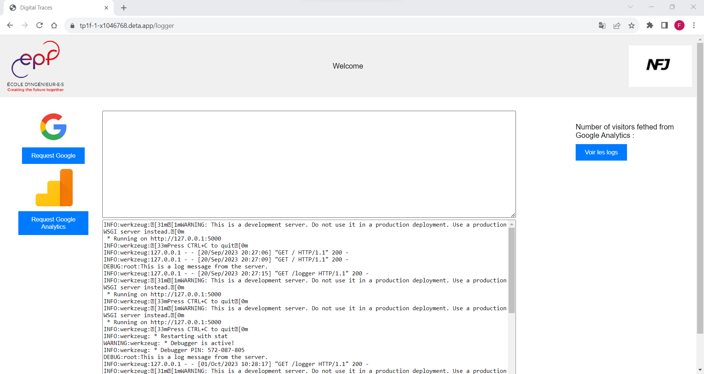
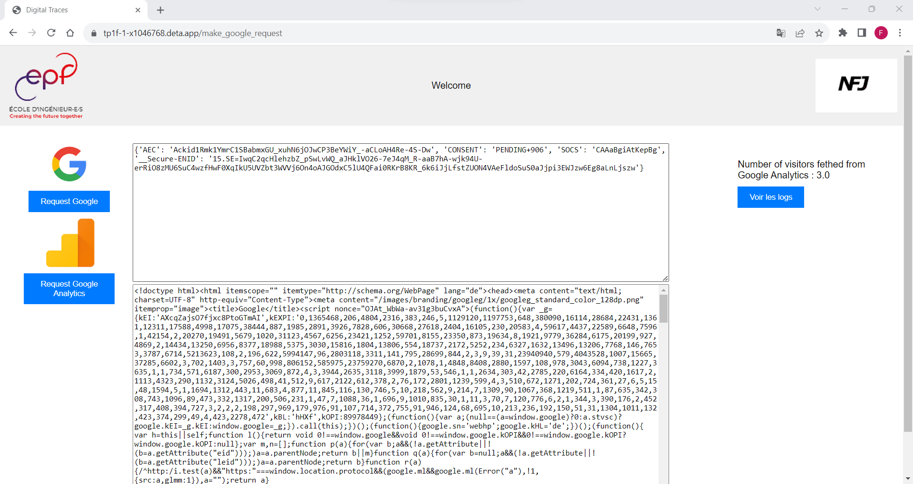
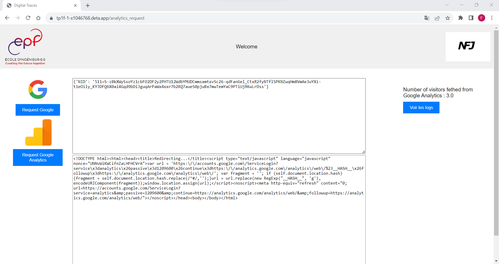

# My First Flask App

This an app developped using the framework Flask and accessible through the link : [https://tp1f-1-x1046768.deta.app/](https://tp1f-1-x1046768.deta.app/)

## Description
Our App has four functions:
* See logs
* Make a request to Google
* Make a request to Google Analytics
* Get the number of users from Google Analytics

You can see the logs of our app by press the button *Voir les logs*

To make a request to Google (www.google.com) Press the button *Request Google*

To make a request to Google Analytics Press the button *Request Google Analytics*

The number of users fetched from Google Analytics is printed in the right corner of the app.

## Endpoints

## Deployment

## Testing

## Ressources
